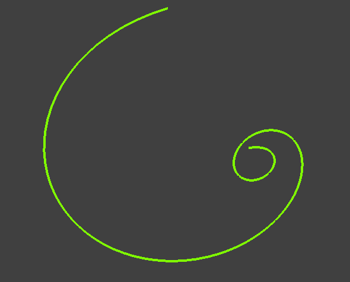
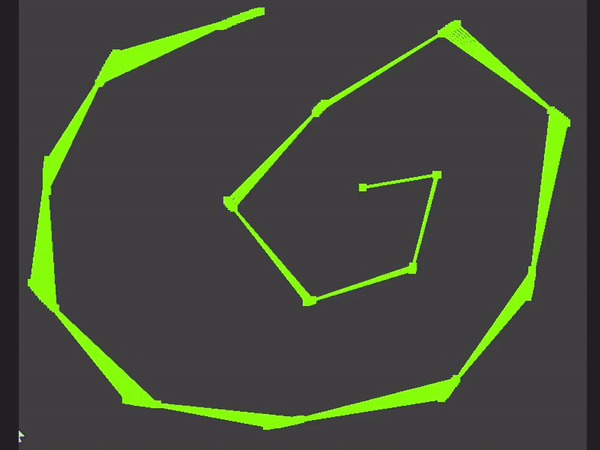

# BezierPaths

This project uses Bezier curves o arbitrary order to generate a smooth and controlled path that an object can follow. The goal is to allow the object to move along this path with natural and precise motion, using the properties of Bezier curves to define the direction and shape of the trajectory at each point.


## DEFINITION OF BEZIER CURVES: 
"Bezier curves are parametric curves defined by a set of control points, with each point influencing the final shape of the curve. The number of control points determines the order of the curve.


In the case of a first-order Bezier curve, it is defined by the formula:

$$
B(t) = (1 - t) P_0 + t P_1 , \quad 0 < t < 1
$$

This represents a simple linear interpolation between two points, where the parameter \( t \) controls the position on the Bezier curve, varying from 0 to 1. At \( t = 0 \), the curve corresponds to the initial control point \( P_0 \), and at \( t = 1 \), the curve reaches the final control point \( P_n \). Throughout the intermediate values of \( t \), the curve moves smoothly between these control points.

For a second-degree Bezier curve, the formula becomes:

$$
B(t) = (1 - t) \left((1 - t) P_0 + t P_1 \right) + t \left((1 - t) P_1 + t P_2 \right), \quad 0 < t < 1
$$

In this case, we first calculate the intermediate points \( L_0 \) and \( L_1 \) by linear interpolation between \( P_0 \) and \( P_1 \), and between \( P_1 \) and \( P_2 \), respectively. Then, we find the point on the curve \( B(t) \) by interpolating between \( L_0 \) and \( L_1 \), based on the parameter \( t \). For higher-order Bezier curves, the formula is generalized using Bernstein polynomials, so that a curve of order \( n \) is described by the relation:

$$
B(t) = \sum_{i=0}^{n} \binom{n}{i} (1 - t)^{n-i} t^i P_i, \quad 0 < t < 1
$$

where \( P_i \) represents the control points, and the first term in the sum is a binomial coefficient.

## IMPLEMENTATION
The creation of Bezier curves is done through two functions in the `Curve` class: `CreateCurve()` and `DrawCurve()`. The `CreateCurve()` function handles populating the necessary buffers for representing the curve, while `DrawCurve()` is responsible for the actual drawing of the curve.


`CreateCurve():`
 ```cpp
if (t <= 1.0f)
{
    glm::vec2 point(0.0f, 0.0f);

    for (int i = 0; i < n; i++)
    {
        float bernsteinPoly = BinomC(n - 1, i) * 
                              std::pow(t, i) * 
                              std::pow(1 - t, n - 1 - i);

        point += controlPoints[i] * bernsteinPoly;
    }
    curveStrip.push_back(point);

    glBindBuffer(GL_ARRAY_BUFFER, curveVBO.GetID());
    glBufferSubData(GL_ARRAY_BUFFER, 0, 
                    curveStrip.size() * sizeof(glm::vec2), 
                    curveStrip.data());

    t += dt;  // t forward for the next frame
}
```

`DrawCurve():`
 ```cpp
    glLineWidth(4.0);
    glBindVertexArray(curveVAO.GetID());
    glDrawArrays(GL_LINE_STRIP, 0, curveStrip.size());
 ```

|  | |
|---|---|
|   |  |


For the `CreateCurve()` function, it is mentioned that the variables `t` and `dt` are of type `float`, initialized to `0.0f` and `0.1f` respectively. The function iterates over the control points to determine the current point on the Bezier curve, based on the current parameter `t`, and updates the buffer associated with the curve, `curveVBO`, using the `glBufferSubData()` function.

To create a complete visualization of the Bezier curve creation process, the functions have been modified as follows:

`CreateCurve():`
 ```cpp
 int n = controlPoints.size();

 // Clear previous frame data
 lerpLines.clear();
 controlPolygons.clear();

 if (t <= 1.0f)
 {

     glm::vec2 point(0.0f, 0.0f);

     for (int i = 0; i < n; i++)
     {
         float bernsteinPoly = BinomC(n - 1, i) * 
                               std::pow(t, i) * 
                               std::pow(1 - t, n - 1 - i);
         point += controlPoints[i] * bernsteinPoly;

     }
     curveStrip.push_back(point);

     std::vector<glm::vec2> currentControlPoly = controlPoints;

     // Continue interpolating until a single point
     while (currentControlPoly.size() > 1)
     {
         std::vector<glm::vec2> nextControlPoly;  
         std::vector<glm::vec2> currentLerpLine; 

         for (int i = 0; i < currentControlPoly.size() - 1; i++)
         {
             glm::vec2 L = (1 - t) * currentControlPoly[i] + 
                            t * currentControlPoly[i + 1];
                            
             nextControlPoly.push_back(L);
             currentLerpLine.push_back(L);  
         }

         controlPolygons.push_back(currentLerpLine);

         currentControlPoly = nextControlPoly;
     }


     glBindBuffer(GL_ARRAY_BUFFER, curveVBO.GetID());
     glBufferSubData(GL_ARRAY_BUFFER, 0, 
                     curveStrip.size() * sizeof(glm::vec2), 
                     curveStrip.data());


     t += dt;  // t forward for the next frame
 }
 ```

 In the first part of the function that creates the Bezier curve, the basic logic remains the same. However, to visualize the entire process of curve creation, we need to store each set of interpolated points for each draw call. This storage is done in the `controlPolygons` vector, which is a vector of vectors of vectors of type `vec2`, representing points.

The `controlPolygons` container will contain:
- At the first position, the set of interpolated points located on the segments between the control points;
- At the second position, the interpolated points located on the segments between the interpolated points from the previous step;
- And so on, until the current set contains a single point, at which point we are at the last interpolation level (i.e., when `currentControlPoly.size() > 1`).


`DrawCurve():`
 ```cpp
     glLineWidth(4.0);
     glBindVertexArray(curveVAO.GetID());
     glDrawArrays(GL_LINE_STRIP, 0, curveStrip.size());

     for (const auto& points : controlPolygons)
     {
         if (!points.empty())
         {
             glBindBuffer(GL_ARRAY_BUFFER, lerpVBO.GetID());
             glBufferData(GL_ARRAY_BUFFER, 
                          points.size() * sizeof(glm::vec2), 
                          points.data(), GL_DYNAMIC_DRAW);

             glBindVertexArray(lerpVAO.GetID());
        
             glPointSize(10.0f);

             this->GetShader()->use();

             glDrawArrays(GL_POINTS, 0, points.size());
             glDrawArrays(GL_LINE_STRIP, 0, points.size());
         }

     }

 ```

|  | |
|---|---|
|   ||


## OBJECT TRANSFORMATIONS
To correctly update the position and direction of the object, at each call to the `CreateCurve()` function, we need to set the current position to the point on the Bezier curve that is being drawn at that moment. Additionally, we need to rotate the object around the Z-axis by the angle formed by the tangent vector to the curve at the current point.

 ```cpp
 
  if (t <= 1.0f)
  {

     glm::vec2 point(0.0f, 0.0f);

     for (int i = 0; i < n; i++)
     {
         float bernsteinPoly = BinomC(n - 1, i) * 
                               std::pow(t, i) * 
                               std::pow(1 - t, n - 1 - i);
         point += controlPoints[i] * bernsteinPoly;

     }

     curveStrip.push_back(point);

     rect->SetPosition(point);

     if (curveStrip.size() >= 3)
     {
         glm::vec2 P0 = curveStrip[curveStrip.size() - 2];
         glm::vec2 P1 = curveStrip[curveStrip.size() - 1];

         glm::vec2 tangent = glm::normalize(P1 - P0);

         angleRad = std::atan2(tangent.y, tangent.x);

         rect->SetRotation(angleRad);

     }
     
     t += dt;  // t forward for the next frame
 }
 ```

The `atan2` function is a special variant of the `atan` function, which calculates the angle between the tangent vector to the curve and the Ox axis, taking into account the sign of the components of the tangent vector (i.e., its direction).


|  | |
|---|---|
|   |  |


 